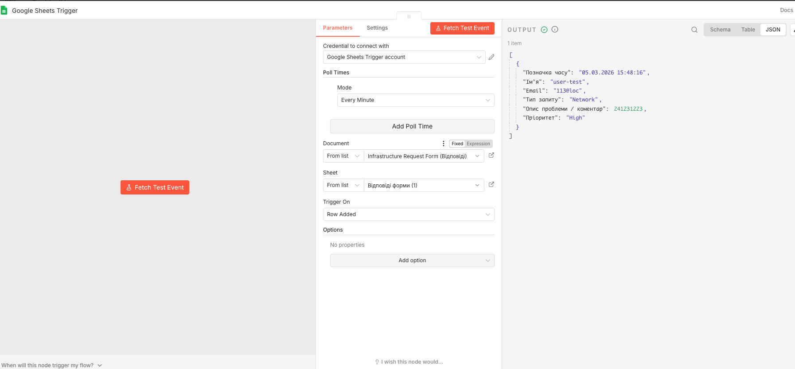
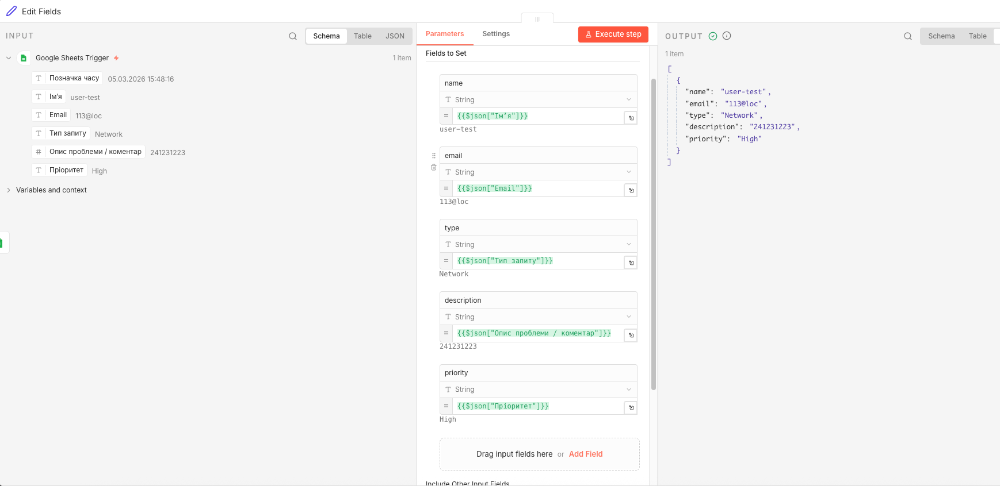
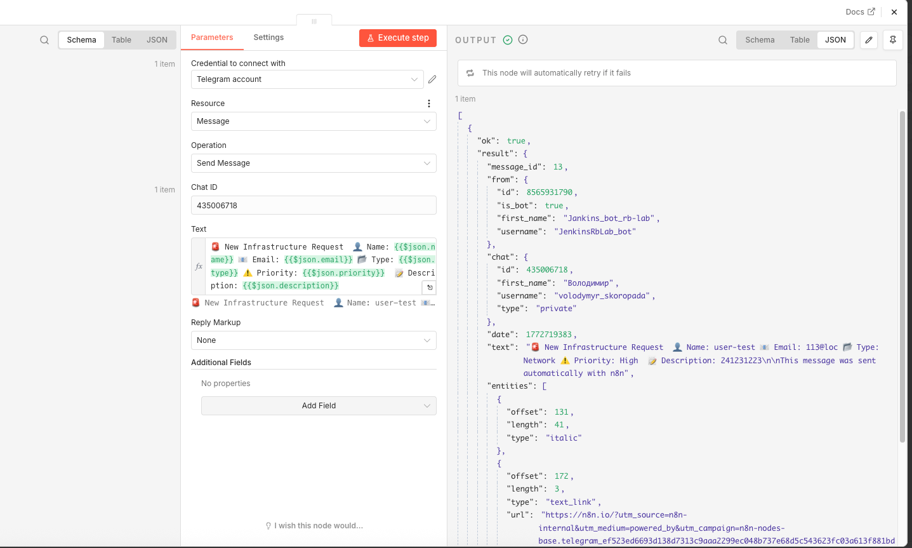
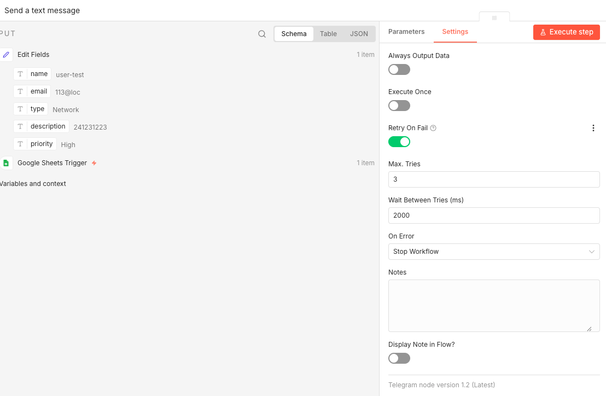
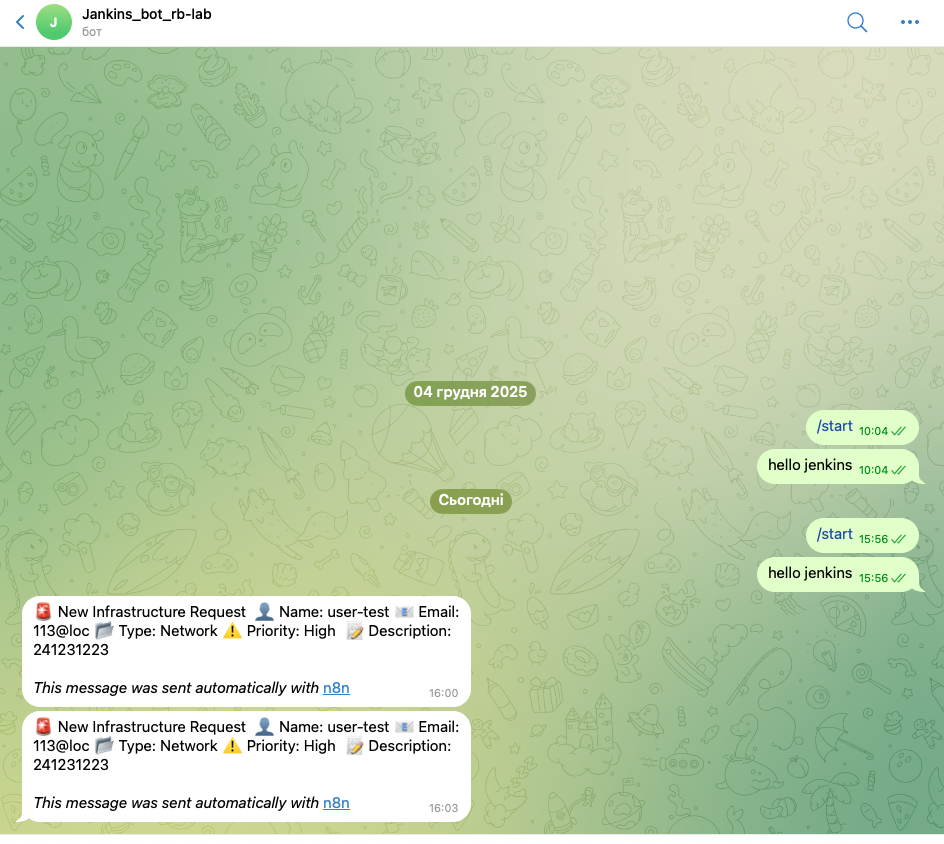

# Lab 23 — Автоматизація workflow з n8n

## Мета

Створити автоматизований workflow, який:

- отримує відповіді з Google Forms
- обробляє дані
- надсилає повідомлення у Telegram

---

## Архітектура

Google Form → Google Sheets → n8n → Telegram Bot

---

## Розгортання n8n

n8n розгорнуто локально за допомогою Docker Compose.
docker compose up -d

Інтерфейс доступний: http://localhost:5678

---

## Google Form

Створено форму з такими полями:

- Ім’я
- Email
- Тип запиту
- Опис проблеми / коментар
- Пріоритет (Low / Medium / High)

Відповіді автоматично зберігаються у Google Sheets.

---

## Workflow

Workflow складається з трьох нод:

Google Sheets Trigger
↓
Edit Fields (обробка даних)
↓
Telegram (відправка повідомлення)

---

## Google Sheets Trigger

Trigger відслідковує появу нового рядка у таблиці відповідей Google Forms.

---

## Обробка даних

Node **Edit Fields (Set)** формує структуру даних із відповіді форми.

---

## Telegram інтеграція

Node **Telegram → Send Message** надсилає повідомлення у чат.

Формат повідомлення:
🚨 New Infrastructure Request

Name: {{ $json.name }}
Email: {{ $json.email }}
Type: {{ $json.type }}
Priority: {{ $json.priority }}

Description: {{ $json.description }}

---

## Retry механізм

Для Telegram node налаштовано повторну спробу у випадку помилки API:

- Max tries: 3
- Wait between tries: 2000 ms

---

## Приклад повідомлення

При створенні нової заявки у Telegram надсилається повідомлення:

🚨 New Infrastructure Request
Name: user-test
Email: 113@loc
Type: Network
Priority: High
Description: 241231223

---

