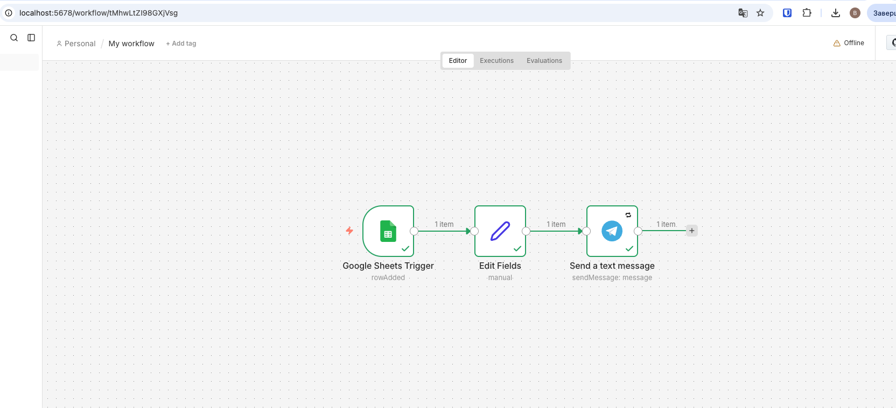

# Lab 23 — Автоматизація обробки заявок (n8n)

## Мета

Побудувати workflow автоматизації, який:

- отримує відповіді з Google Forms
- обробляє дані
- надсилає повідомлення в Telegram

---

## Архітектура

Google Form → Google Sheets → n8n → Telegram Bot

---

## Крок 1 — Розгортання n8n

n8n розгорнуто локально через Docker Compose.

Команда запуску:
docker compose up -d

Інтерфейс доступний:
http://localhost:5678

---

## Крок 2 — Google Form

Створено форму з такими полями:

- Ім’я
- Email
- Тип запиту
- Опис проблеми
- Пріоритет (Low / Medium / High)

Відповіді автоматично зберігаються у Google Sheets.

---

## Крок 3 — Telegram Bot

Створено Telegram-бот через **BotFather**.

Отримано:

- Bot Token
- chat_id

Бот використовується для надсилання повідомлень про нові заявки.

---

## Крок 4 — n8n Workflow

Workflow складається з трьох нод:

Google Sheets Trigger
↓
Set (обробка даних)
↓
Telegram (відправка повідомлення)

Trigger спрацьовує при появі нового рядка в Google Sheets.

---

## Приклад повідомлення
🚨 New Infrastructure Request

Name: user-test
Email: 113@loc
Type: Network
Priority: High
Description: 241231223

---

## Результат

Workflow автоматично:

1. отримує заявки з Google Forms
2. обробляє дані
3. надсилає повідомлення в Telegram
