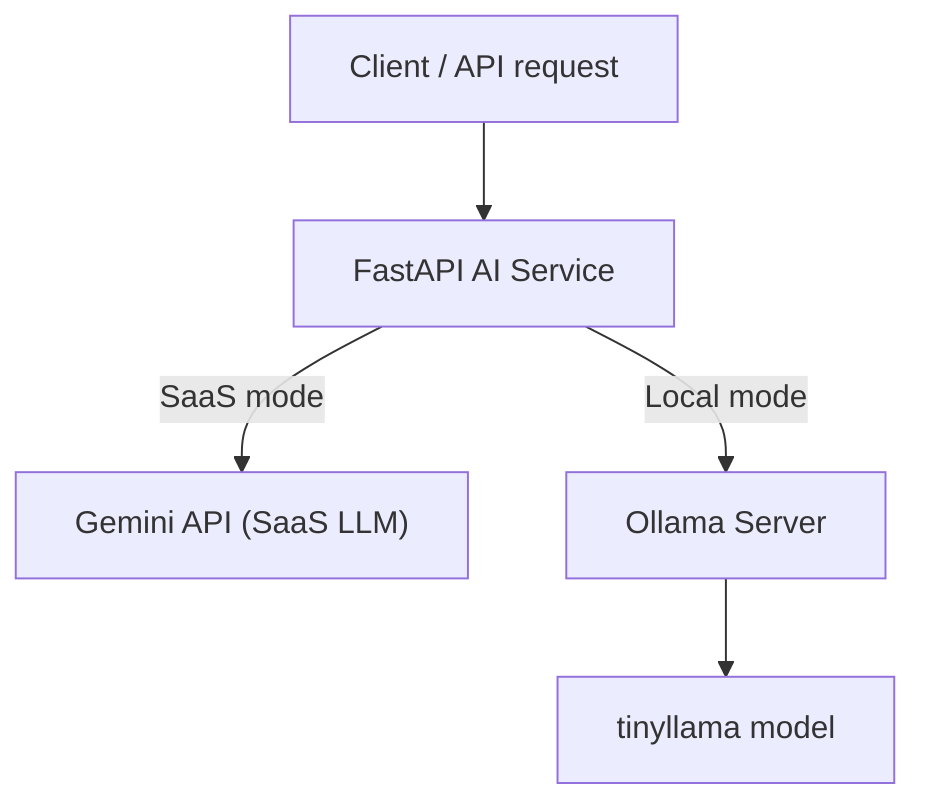

# №24 — MLOps  
## AI Customer Support Service

Простий AI-сервіс підтримки користувачів, який відповідає на запитання через API.

Сервіс підтримує дві архітектури роботи з LLM:

- **SaaS LLM** — через Gemini API  
- **Self-hosted LLM** — локальна модель через Ollama  

API реалізовано на **FastAPI**, сервіс контейнеризовано через **Docker**.

---

# Архітектура рішення



---

# Структура проєкту

```
lab-24-mlops
│
├── app
│   ├── main.py
│   ├── gemini_client.py
│   └── ollama_client.py
│
├── Dockerfile
├── requirements.txt
└── README.md
```

---

# API Endpoint

## POST /ask

Endpoint дозволяє поставити запитання AI-сервісу.

### Request

```json
{
  "question": "How do I reset my password?"
}
```

### Query параметр

```
mode=saas   → Gemini API
mode=local  → Ollama
```

### Response

```json
{
  "answer": "To reset your password..."
}
```

---

# Встановлення Ollama

Встановлення Ollama:

```
curl -fsSL https://ollama.com/install.sh | sh
```

---

# Завантаження моделі

Для лабораторної використовується легка модель:

```
ollama pull tinyllama
```

Перевірка:

```
ollama run tinyllama
```

---

# Запуск сервісу локально

Створити virtual environment:

```
python3 -m venv venv
source venv/bin/activate
```

Встановити залежності:

```
pip install -r requirements.txt
```

Запустити API:

```
uvicorn app.main:app --host 0.0.0.0 --port 8000
```

Swagger UI:

```
http://localhost:8000/docs
```

---

# Запуск через Docker

## Побудова контейнера

```
docker build -t ai-support-bot .
```

---

## Запуск контейнера

```
docker run --network host \
-e GOOGLE_API_KEY=********_API_KEY \
ai-support-bot
```

---

# Тестування API

```
curl -X POST "http://localhost:8000/ask?mode=local" \
-H "Content-Type: application/json" \
-d '{"question":"How do I reset my password?"}'
```

---

